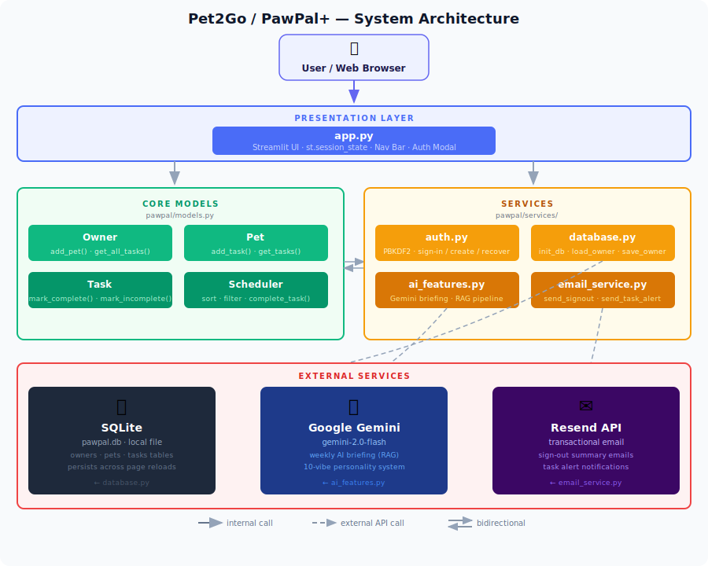

# Pet2Go

---
## Link to the Loom Presentation: https://www.loom.com/share/a507a03120ee4fb78d00e692c81bf426
## Title and Summary

**Title:** Pet2Go — AI-Powered Pet Care Scheduler

**Original project:** The original project (Modules 1–3) was **PawPal+**, a Streamlit pet care scheduling app built around four core classes — `Owner`, `Pet`, `Task`, and `Scheduler`. PawPal+ let pet owners create pets, schedule care tasks with frequency and priority, detect time-window conflicts, auto-reschedule daily/weekly tasks on completion, and persist all data to SQLite across sessions. It also included user authentication and an email reminder service.

**Capstone extension:** Pet2Go extends PawPal+ with a Groq-powered weekly briefing that uses Retrieval-Augmented Generation (RAG) — the app retrieves the owner's full task schedule from the database, structures it day-by-day with daily tasks expanded across the week, and passes it as context to Groq (llama-3.3-70b-versatile), which returns a personalised natural-language summary with a unique personality vibe every time the user signs in. This moves the app from a data organiser to an intelligent assistant that actively communicates what care is needed and when.

---

## Architecture Overview

### System Diagram



Pet2Go is built around four core classes that keep responsibilities clearly separated:

- **`Task`** — a single pet care activity (description, start time, duration, frequency, priority, completion state).
- **`Pet`** — holds a list of `Task` objects for one animal.
- **`Owner`** — aggregates multiple `Pet` objects and stores schedule preferences (max tasks per day, available minutes).
- **`Scheduler`** — the "brain." All scheduling intelligence lives here: sorting, filtering, conflict detection, and schedule generation. `Task` and `Pet` stay as simple data holders.

Supporting services in `pawpal/services/`:

| File | Role |
|---|---|
| `database.py` | SQLite persistence — saves and reloads the full Owner → Pet → Task graph across sessions |
| `auth.py` | Login gate — protects the dashboard and binds data to a user email |
| `email_service.py` | Sends task summaries to a specified email address on sign-out |
| `ai_features.py` | RAG layer — retrieves and structures tasks, calls Groq for creative natural-language briefings |

The Streamlit UI (`app.py`) delegates every data operation to these classes and services — no raw data manipulation happens in the UI layer.

**Conflict detection:**
`Scheduler.detect_conflicts_for_task()` compares the new task's time window against every existing timed task on that pet using duration-aware overlap logic. Warnings surface non-blocking in the UI so owners can override if intentional.

---

## Setup Instructions

### Prerequisites

- Python 3.9 or higher
- pip (comes with Python)

### 1. Clone or download the project

```bash
git clone <repo-url>
cd applied-ai-system-project
```
  
### 2. Create and activate a virtual environment

```bash
python -m venv .venv
source .venv/bin/activate  # Windows: .venv\Scripts\activate
```

### 3. Install dependencies

```bash
pip install -r requirements.txt
```

### 4. Add API keys

Create `.streamlit/secrets.toml` by copying from the template:

```bash
cp .streamlit/secrets.toml.example .streamlit/secrets.toml
```

Edit `.streamlit/secrets.toml` and add your API keys:

```toml
RESEND_API_KEY = "re_your_resend_key_here"
GROQ_API_KEY = "gsk_your_groq_key_here"
```

- `GROQ_API_KEY` — required for the Groq weekly briefing with creative personality vibes. Get one for free at [Groq Console](https://console.groq.com).
- `RESEND_API_KEY` — required for email reminders on sign-out. Get one at [resend.com](https://resend.com). The app runs without it; email features are silently skipped.

**Important:** `.streamlit/secrets.toml` is in `.gitignore` and should never be committed. Never paste real API keys in code or documentation.

### 6. Run the app

```bash
streamlit run app.py
```

The app will open automatically in your browser at `http://localhost:8501`.

### 7. (Optional) Inspect the database from the terminal

To view the contents of `pawpal.db` without opening a database client, run:

```bash
# All tables
python scripts/logTable.py

# One specific table
python scripts/logTable.py users

# Multiple specific tables
python scripts/logTable.py pets tasks
```

Each table prints its row count, column headers, and all rows aligned in the terminal. Available tables: `users`, `owner_prefs`, `pets`, `tasks`.

---

## Features

| Feature                       | Description                                                                                                                                                         |
| ----------------------------- | ------------------------------------------------------------------------------------------------------------------------------------------------------------------- |
| **Add owners & pets**         | Create an owner profile and register multiple pets, each tracked independently.                                                                                     |
| **Task management**           | Add care tasks to any pet with a description, required start time, frequency, duration, and priority.                                                               |
| **Conflict warnings**         | Conflict detection flags overlapping time windows immediately on task add using duration-aware overlap logic.             |
| **Sorting by time**           | The schedule is always displayed in chronological order (earliest first). Tasks without a scheduled time are sorted to the bottom automatically.                    |
| **Filtering**                 | Filter the schedule by pet name, by completion status (pending only), or both at once — without touching any other pet's data.                                      |
| **Daily & weekly recurrence** | Completing a `daily` or `weekly` task automatically schedules the next occurrence (+1 day or +7 days). One-time and monthly tasks are simply marked done.           |
| **Schedule metrics**          | A summary row shows total tasks, pending count, and completed count for the current filtered view.                                                                  |
| **Status indicators**         | Task completion is displayed as ✅ Done / ⏳ Pending throughout the UI instead of raw boolean values.                                                               |
| **SQLite persistence**        | All data survives page refreshes — owner, pets, and tasks are stored in a local SQLite database and restored on login.                                              |

---

## Sample Interactions

### 1 — Sign-in with daily tasks scheduled

**Setup:** Owner "Seth" has a dog named Buddy with two daily tasks: morning walk at 8:00 AM and evening feed at 6:00 PM. Today is Saturday April 25; tasks have rolled forward to Sunday April 26.

**Data sent to Groq:**
```
Sunday, April 26 (tomorrow):
  - Buddy: Morning walk at 8:00 AM (30 min, high priority, daily)
  - Buddy: Evening feed at 6:00 PM (10 min, medium priority, daily)

Monday, April 27:
  - Buddy: Morning walk at 8:00 AM (30 min, high priority, daily)
  - Buddy: Evening feed at 6:00 PM (10 min, medium priority, daily)
... (repeated through the week)
```

**Groq's output (one possible vibe — cheerful radio host):**
> "Hey Seth! Welcome back! Buddy's got quite the schedule tomorrow — you'll kick things off with his morning walk at 8:00 AM, then wrap the day with his evening feed at 6:00 PM. Those two are going to repeat every single day this week, so you're all set for a great routine. Your pup is one lucky dog! 🐾"

---

### 2 — Sign-in with a one-time appointment tomorrow

**Setup:** Owner has a cat named Charlie with a vet checkup scheduled for Sunday April 26 at 10:00 AM (frequency: once).

**Data sent to Groq:**
```
Sunday, April 26 (tomorrow):
  - Charlie: Vet checkup at 10:00 AM (60 min, high priority, once)
```

**Groq's output (one possible vibe — poetic and caring):**
> "Welcome back. Tomorrow morning brings an important moment — Charlie's vet checkup at 10:00 AM. It's a single hour, but a cherished one. Prepare your questions gently, and know that Charlie is in capable, loving hands. The bond you share shows in every care you take. 🐾"

---

### 3 — Conflict detection on task add

**Setup:** Buddy already has "Morning walk" at 9:00 AM for 60 minutes. User tries to add "Vet check" at 9:20 AM for 30 minutes.

**App response (inline warning):**
> ⚠️ Schedule conflict on Buddy: "Vet check" (9:20 AM, 30 min) overlaps with "Morning walk" (9:00 AM, 60 min)

Task is still saved; the warning is non-blocking so the owner can override if intentional.

---

## Design Decisions

**Scheduler as the single "brain"**
All scheduling intelligence lives in the `Scheduler` class. `Task` and `Pet` are intentionally kept as simple data holders. This means the UI never manipulates data directly — it calls `Scheduler` methods and displays results. The trade-off is a slightly more verbose call chain, but it makes the logic easy to test in isolation and extend without touching the UI.

**Duration-aware conflict detection**
The original conflict check only flagged tasks at the *exact same datetime*. Two tasks at 9:00 and 9:20 with 60- and 30-minute durations would silently overlap. The updated logic checks whether time windows intersect — `task_a.start < task_b.end AND task_b.start < task_a.end` — using `max(duration, 1)` so zero-duration tasks still catch exact-time collisions. The trade-off is slightly more complex logic, but the result is trustworthy conflict detection.

**Non-blocking warnings**
Conflict warnings are informational, not gatekeeping. A task is always saved; the warning appears alongside the success message. This choice respects that the owner may be scheduling intentionally overlapping tasks (e.g., supervised activities) and shouldn't be locked out. The trade-off is that users must pay attention to warnings rather than being forced to resolve them.

**Mandatory start times**
Start times were previously optional (hidden behind a checkbox). Requiring a start time for every task makes conflict detection reliable and keeps the schedule view meaningful. The trade-off is slightly more friction when adding informal tasks, but the payoff is that every task appears in a sortable, conflict-checkable timeline.

**SQLite over session state only**
Streamlit's `st.session_state` resets on page refresh. SQLite persistence means users don't lose their data between sessions. The trade-off is a local database file (`pawpal.db`) that must be present — but for a single-owner local tool this is appropriate, and the schema is simple enough to migrate easily if needed.

---

## Testing Summary

The test suite lives in `tests/test_pawpal.py` and is run with:

```bash
python -m pytest
```

**What is tested:**

| Test | What it covers |
|---|---|
| `test_task_completion` | `mark_complete()` flips `completed` from `False` to `True` |
| `test_task_addition_to_pet` | `add_task()` increases the pet's task count by exactly 1 |
| `test_sort_by_time_chronological_order` | Tasks sort ascending by time; `time=None` tasks go last |
| `test_complete_daily_task_creates_next_occurrence` | Completing a daily task auto-schedules a follow-up +1 day later |
| `test_detect_conflicts_flags_duplicate_times` | Exact-time collision surfaces a warning with both task names |
| `test_detect_conflicts_no_false_positives` | Tasks at different times produce no warnings |
| `test_detect_conflicts_for_task_flags_overlap` | Duration-based overlap (9:00 60 min vs 9:20 30 min) triggers a warning |
| `test_detect_conflicts_for_task_no_overlap` | Well-separated tasks produce no warnings |
| `test_detect_conflicts_for_task_no_time` | A timeless task never triggers a conflict |
| `test_detect_conflicts_for_task_ignores_self` | A task is not compared against itself |
| `test_generate_schedule_respects_max_tasks` | Schedule is capped at `max_tasks_per_day` |
| `test_generate_schedule_priority_order` | High-priority tasks are selected before low-priority ones |
| `test_generate_schedule_respects_time_budget` | Tasks that exceed `available_minutes` are excluded |

**What worked well:** Testing the logic layer in complete isolation from Streamlit was straightforward — the class structure made it easy to construct `Owner → Pet → Task` graphs in a few lines and assert exact outcomes.

**What was harder:** The email service and Groq API calls are not unit tested here because they depend on live credentials and network calls. Those paths are validated manually during development.

---

## Reflection

Building Pet2Go taught me that integrating AI into a real application is less about prompting and more about data architecture. The hardest part wasn't writing the Groq prompt — it was making sure the right data reached the model in the right shape. Daily tasks that only have one pending instance in the database needed to be expanded across every day of the week before being sent to Groq, otherwise the AI had no way to know a task would repeat tomorrow. That "retrieval and structuring" step is the heart of RAG, and getting it right made the difference between Groq generating a generic greeting and a genuinely useful, specific summary.

I also learned how quickly silent failures compound. The earliest version of the briefing feature looked like it was working — no errors, no crashes — but the API was never actually being called because the API key was missing or commented out, and the exception handler silently returned an empty string. Adding structured logging (`_log.warning`, `_log.error` with `exc_info=True`) immediately made invisible failures visible, which is a habit I'll carry into every future project.

Adding the creative vibe system (10 distinct personality styles picked at random for each login) showed me that injecting personality into an AI prompt isn't expensive — it's just a matter of building a small curated list and sampling it. The temperature tuning from 0 to 1.3 and the shorter token budgets (180 vs 400) also taught me that speed and creativity aren't trade-offs; they enable each other. Faster responses reduce latency on every login, making the app feel snappier, and lower token caps force the model to be more concise and punch above its weight.

Finally, the testing suite showed me that AI outputs are hard to assert on directly, but the data pipeline feeding them is fully testable. I can't write a test that checks "Groq said the right thing," but I can write tests that verify completed tasks are excluded, out-of-range tasks are filtered, and the function returns empty when the API key is missing. Separating what the AI does from what the system does around it made the whole application easier to reason about and trust.

---

